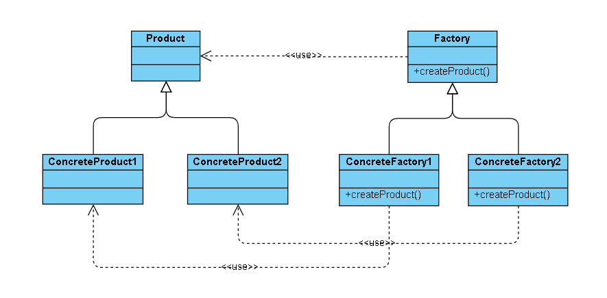
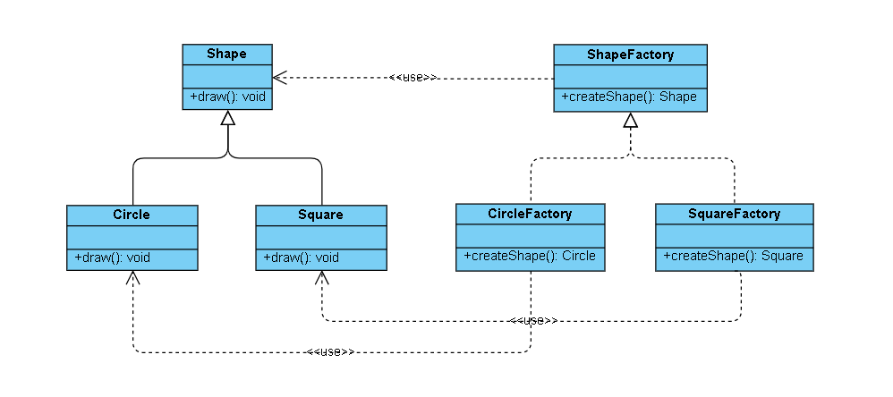

## 工厂方法模式

又称工厂模式、多态工厂模式和虚拟构造器模式，通过定义工厂父类负责定义创建对象的公共接口，而子类则负责生成具体的对象。即将类的实例化（具体产品的创建）延迟到工厂类的子类（具体工厂）中完成，由子类来决定应该实例化（创建）哪一个类。被创建的对象称为“产品”，把创建产品的对象称为“工厂”。

---

### 一、模式分析

#### 1.1 优缺点

工厂方法模式的优点：
- 只需要知道具体工厂的名称就可得到所要的产品，无须知道产品的具体创建过程；
- 在系统增加新的产品时只需要添加具体产品类和对应的具体工厂类，无须对原工厂进行任何修改，满足开闭原则。

工厂方法的缺点：
- 每增加一个产品就要增加一个具体产品类和一个对应的具体工厂类，这增加了系统的复杂度。

#### 1.2 应用场景

工厂方法模式通常用于以下场景：
- 对于某个产品，调用者清楚地知道应该使用哪个具体工厂服务，实例化该具体工厂，生产出具体的产品；
- 只是需要一种产品，而不想知道也不需要知道究竟是哪个工厂为生产的，即最终选用哪个具体工厂的决定权在生产者一方，它们根据当前系统的情况来实例化一个具体的工厂返回给使用者，而这个决策过程这对于使用者来说是透明的。

---

### 二、模型结构

工厂方法模式的主要角色如下：
1. 抽象工厂（AbstractFactory）：提供了创建产品的接口，通过它访问具体工厂的工厂方法来创建产品。
2. 具体工厂（ConcreteFactory）：主要是实现抽象工厂中的抽象方法，完成具体产品的创建。
3. 抽象产品（Product）：定义了产品的规范，描述了产品的主要特性和功能。
4. 具体产品（ConcreteProduct）：实现了抽象产品角色所定义的接口，由具体工厂来创建，它同具体工厂之间一一对应。



---

### 三、示例程序

首先给出示例程序的类结构图：



其中 Shape 是工厂方法模式中的 Product，Circle 和 Square 是工厂方法模式中的 ConcreteProduct，ShapeFactory 是工厂方法模式中的 Factory
，CircleFactory 和 SquareFactory 是工厂方法模式中的 ConcreteFactory。

#### 3.1 Shape 抽象产品类

```
public abstract class Shape {

    public abstract void draw();

}

```

#### 3.2 Circle 和 Square 具体产品类

```
class Circle extends Shape {

    public Circle(){}

    @Override
    public void draw() {
        System.out.println("Draw a circle shape!");
    }

}

class Square extends Shape {

    public Square(){}

    @Override
    public void draw() {
        System.out.println("Draw a square shape!");
    }
}
```

#### 3.3 ShapeFactory 抽象工厂方法接口

```
public interface ShapeFactory {

    /**
     * 产品工厂方法
     * @return 产品
     */
    Shape createShape();

}
```

#### 3.4 CirCleFactory 和 SquareFactory 具体产品工厂类

```
class CircleFactory implements ShapeFactory {

    @Override
    public Circle createShape() {
        return new Circle();
    }

}

class SquareFactory implements ShapeFactory {

    @Override
    public Square createShape() {
        return new Square();
    }
}
```
