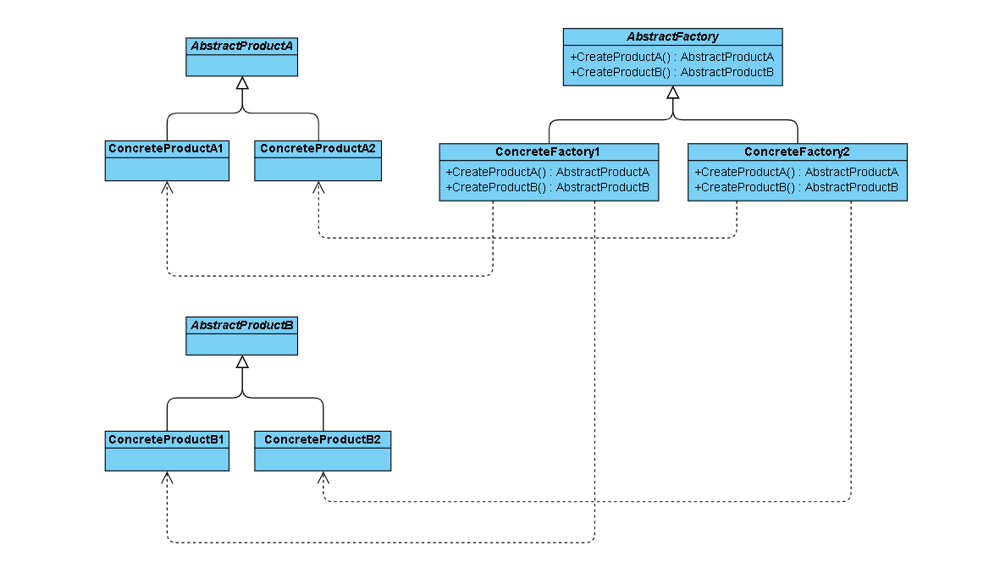
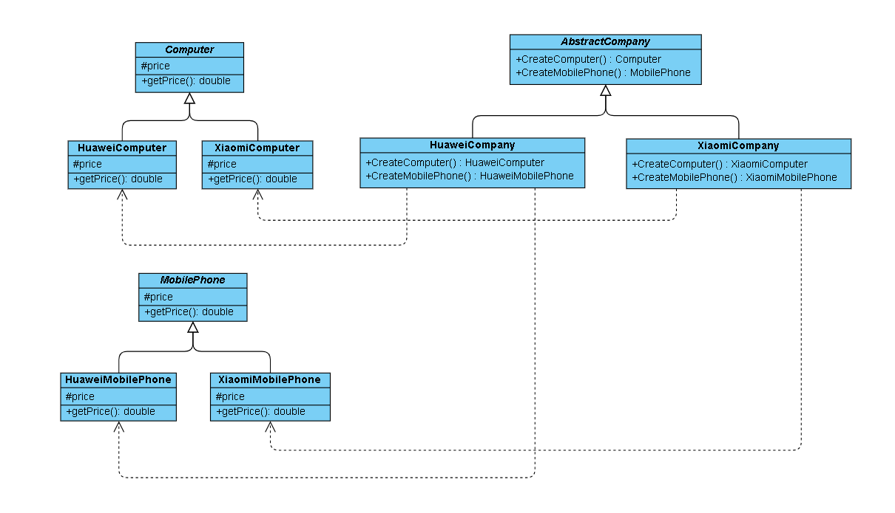

## 抽象工厂模式

抽象工厂（AbstractFactory）是一种为访问类提供一个创建一组相关或相互依赖对象的接口，且访问类无须指定所要产品的具体类就能得到同族的不同等级的产品的模式结构。抽象工厂模式是工厂方法模式的升级版本，工厂方法模式只生产一个等级的产品，而抽象工厂模式可生产多个等级的产品。

---

### 一、模式分析

#### 1.1 产品等级结构和产品族

##### 产品等级结构
即产品的继承结构，如一个抽象类是电视机，其子类有海尔电视机、海信电视机、TCL电视机，则抽象电视机与具体品牌的电视机之间构成了一个产品等级结构，抽象电视机是父类，而具体品牌的电视机是其子类。

##### 产品族
在抽象工厂模式中，产品族是指由同一个工厂生产的，位于不同产品等级结构中的一组产品，如海尔电器工厂生产的海尔电视机、海尔电冰箱，海尔电视机位于电视机产品等级结构中，海尔电冰箱位于电冰箱产品等级结构中，海尔电视机、海尔电冰箱构成了一个产品族。

####  1.1 前提条件

使用抽象工厂模式一般要满足以下条件：
- 系统中有多个产品族，每个具体工厂创建同一族但属于不同等级结构的产品。
- 系统一次只可能消费其中某一族产品，即同族的产品一起使用。

#### 1.2 优缺点

抽象工厂模式的优点：
- 可以在类的内部对产品族中相关联的多等级产品共同管理，而不必专门引入多个新的类来进行管理。
- 当增加一个新的产品族时不需要修改原代码，满足开闭原则。

抽象工厂模式的缺点：
- 当产品族中需要增加一个新的产品时，所有的工厂类都需要进行修改。

#### 二、模型结构

抽象工厂方法模式的主要角色如下：
1. 抽象工厂（AbstractFactory）：提供了创建产品的接口，它包含多个创建产品的方法，可以创建多个不同等级的产品。
2. 具体工厂（ConcreteFactory）：主要是实现抽象工厂中的抽象方法，完成具体产品的创建。
3. 抽象产品（Product）：定义了产品的规范，描述了产品的主要特性和功能。
4. 具体产品（ConcreteProduct）：实现了抽象产品角色所定义的接口，由具体工厂来创建，它同具体工厂之间一一对应。



---

#### 三、示例程序

首先给出示例程序的类结构图：



其中 AbstractCompany，AbstractMobilePhone 是抽象工厂方法模式中的 Product，HuaweiComputer, HuaweiMobilePhone, XiaomiComputer, XiaomiMobilePhone 是抽象工厂方法模式中的 ConcreteProduct，AbsractCompany 是抽象工厂方法模式中的 AbstractFactory
HuaweiCompany 和 XiaomiCompany 是抽象工厂方法模式中的 ConcreteFactory。

##### 3.1 AbsractCompany 抽象工厂类

```
public abstract class AbstractCompany {

    /**
     * 生产电脑产品
     *
     * @return 电脑产品
     */
    public abstract AbstractComputer createComputer();

    /**
     * 生产手机产品
     *
     * @return 手机产品
     */
    public abstract AbstractMobilePhone createMobilePhone();

}
```

##### 3.2 HuaweiCompany 和 XiaomiCompany 具体工厂类

```
public class HuaweiCompany extends AbstractCompany {

    @Override
    public HuaweiComputer createComputer() {
        return new HuaweiComputer();
    }

    @Override
    public HuaweiMobilePhone createMobilePhone() {
        return new HuaweiMobilePhone();
    }
}

public class XiaomiCompany extends AbstractCompany {

    @Override
    public XiaomiComputer createComputer() {
        return new XiaomiComputer();
    }

    @Override
    public XiaomiMobilePhone createMobilePhone() {
        return new XiaomiMobilePhone();
    }
}
```
##### 3.3 AbstractCompany 和 AbstractMobilePhone 抽象产品类

```
public abstract class AbstractComputer {

    /**
     * 价格
     */
    protected Double price;

    public Double getPrice() {
        return price;
    }

    public void setPrice(Double price) {
        this.price = price;
    }

}

public class AbstractMobilePhone {

    /**
     * 价格
     */
    protected Double price;

    public Double getPrice() {
        return price;
    }

    public void setPrice(Double price) {
        this.price = price;
    }

}
```

##### 3.4 具体产品类

```
public class HuaweiComputer extends AbstractComputer {
}

public class XiaomiComputer extends AbstractComputer {
}

public class HuaweiMobilePhone extends AbstractMobilePhone {
}

public class XiaomiMobilePhone extends AbstractMobilePhone {
}
```
