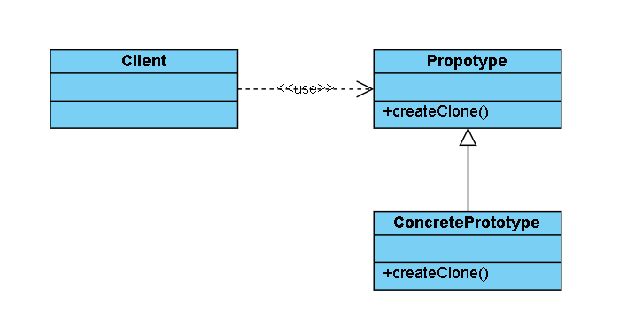
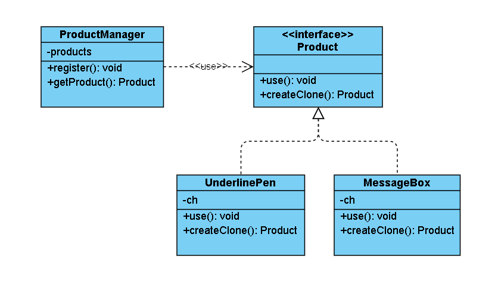

## 原型模式

用一个已经创建的实例作为原型，通过复制该原型对象来创建一个和原型相同或相似的新对象。原型实例指定了要创建的对象的种类，用这种方式创建对象非常高效，根本无须知道对象创建的细节。  
在软件系统中，有些对象的创建过程较为复杂，而且有时候需要频繁创建，原型模式通过给出一个原型对象来指明所要创建的对象的类型，然后用复制这个原型对象的办法创建出更多同类型的对象，这就是原型模式的意图所在。

---

### 一、模式分析

#### 1.1 优缺点

原型模式的优点：
- 当创建新的对象实例较为复杂时，使用原型模式可以简化对象的创建过程，通过一个已有实例可以提高新实例的创建效率。
- 可以动态增加或减少产品类。
- 原型模式提供了简化的创建结构。

原型模式的缺点：
- 需要为每一个类配备一个克隆方法，而且这个克隆方法需要对类的功能进行通盘考虑，这对全新的类来说不是很难，但对已有的类进行改造时，不一定是件容易的事，必须修改其源代码，违背了“开闭原则”。

#### 1.2 应用场景

原型模式通常适用于以下场景。
- 对象之间相同或相似，即只是个别的几个属性不同的时候。
- 对象的创建过程比较麻烦，但复制比较简单的时候。

---

### 二、模型结构

原型模式主要包含以下几种角色：
1. 抽象原型类(Prototype)：负责定义用于复制现有实例来生成新实例的方法。
2. 具体原型类(ConcretePrototype)：负责实现复制现有实例并生成新实例的方法。
3. 访问类(Client)：负责使用复制实例的方法生成新的实例。



---

### 三、实现原理

由于 Java 提供了对象的 clone() 方法，所以用 Java 实现原型模式很简单。原型模式的克隆分为浅克隆和深克隆，Java 中的 Object 类提供了浅克隆的 clone() 方法，具体原型类只要实现 Cloneable 接口就可实现对象的浅克隆。

---

### 四、示例程序

首先给出程序的类结构图：



其中 Product 代表的是原型结构中的 Propotype，UnderlinePen 和 MessageBox 代表的是原型结构中的 ConcretePrototype，而 ProductManager 代表的是原型结构中的 Client。

#### 4.1 Product 接口

```
public interface Product extends Cloneable {

    /**
     * 产品使用的方法
     * @param s
     */
    void use(String s);

    /**
     * 产品克隆的方法
     * @return 克隆出来的新对象
     */
    Product createClone();
}
```

#### 4.2 UnderlinePen 和 MessageBox 具现类

UnderlinePen 是为输出字符串在左右两端添加双引号，并在下边添加下划符号。代码如下：

```
/**
 * 为输出字符串添加下划线，例如：
 *
 * "Strong message product"
 * ~~~~~~~~~~~~~~~~~~~~~~~~
 *
 */
public class UnderlinePen implements Product {

    // 下划符号
    private char ch;

    public UnderlinePen(char ch) {
        this.ch = ch;
    }

    /**
     * 输出字符串左右添加双引号，下边添加下划符号
     * @param s 输出字符串
     */
    @Override
    public void use(String s) {
        int len = s.getBytes().length;
        System.out.println("\"" + s + "\"");
        for (int i = 0; i < len + 2; i++) {
            System.out.print(ch);
        }
        System.out.println();
    }

    @Override
    public Product createClone() {
        Product p = null;
        try {
            p = (Product) clone();
        } catch (CloneNotSupportedException e) {
            e.printStackTrace();
        }
        return p;
    }
}
```

MessageBox 是为输出字符串添加一个输出框。代码如下：

```
/***
 * 为输出字符串添加输出框，例如：
 *
 * ***********************
 * * Warning box product *
 * ***********************
 *
 */
public class MessageBox implements Product {

    // 输出框符号
    private char ch;

    public MessageBox(char ch) {
        this.ch = ch;
    }

    /**
     * 为输出字符串添加一个输出框
     * @param s 输出字符串
     */
    @Override
    public void use(String s) {
        int len = s.getBytes().length;
        for (int i = 0; i < len + 4; i++) {
            System.out.print(ch);
        }
        System.out.println();
        System.out.println(ch + " " + s + " " + ch);
        for (int i = 0; i < len + 4; i++) {
            System.out.print(ch);
        }
        System.out.println();
    }

    @Override
    public Product createClone() {
        Product p = null;
        try {
            p = (Product) clone();
        } catch (CloneNotSupportedException e) {
            e.printStackTrace();
        }
        return p;
    }
}
```

#### 4.3 ProductManager 访问类

```
public class ProductManager {

    // 保存产品原型实例
    private HashMap<String, Product> products = new HashMap<>();

    /**
     * 注册产品原型实例
     * @param name 原型名称
     * @param product 原型实例
     */
    public synchronized void register(String name, Product product) {
        products.put(name, product);
    }

    /**
     * 通过原型名称获取产品新实例对象
     * @param name 产品原型名称
     * @return 产品新实例对象
     */
    public Product getProduct(String name) {
        Product product = products.get(name);
        return product.createClone();
    }

}
```
