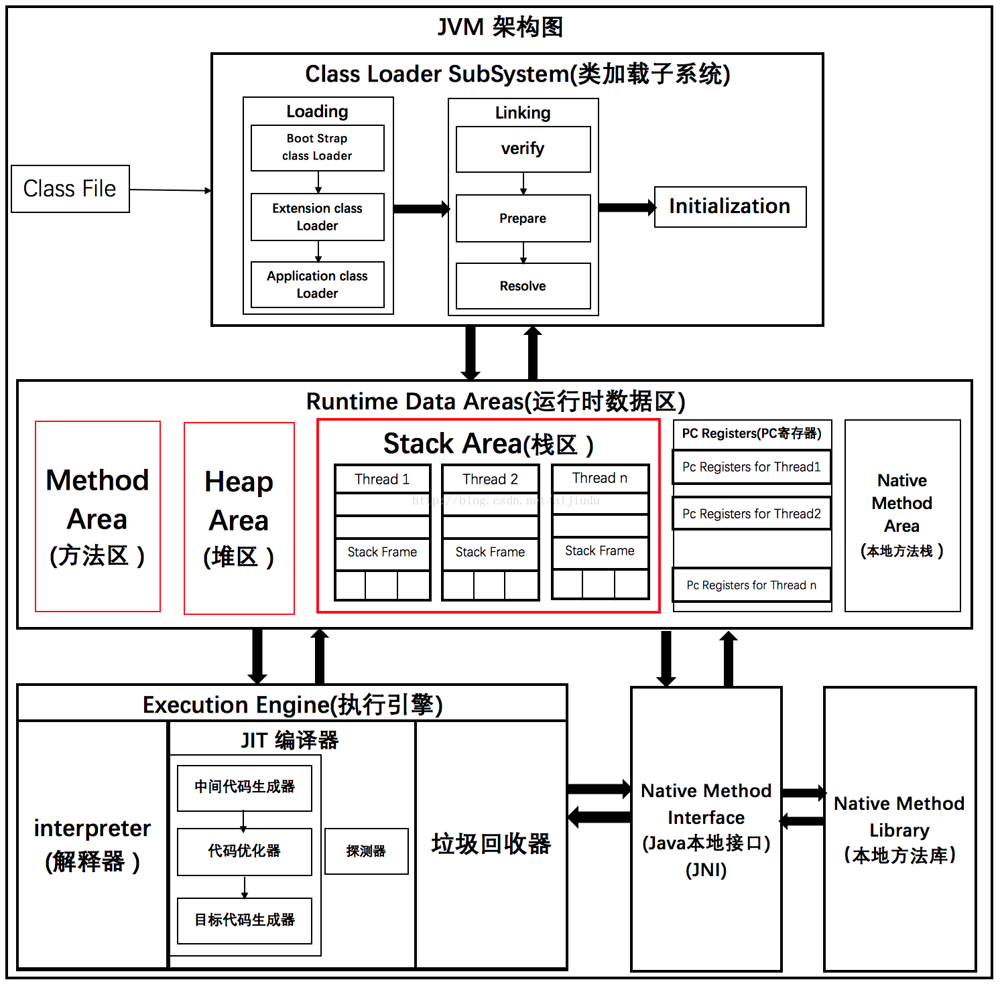
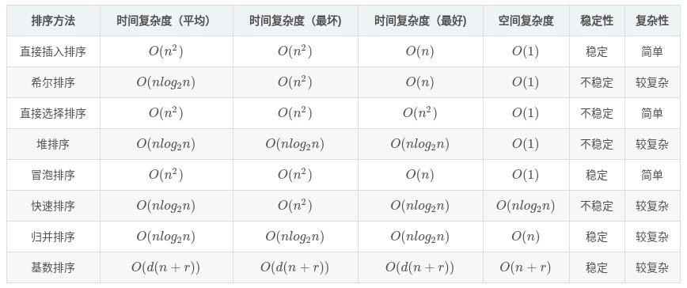

## 阿里巴巴面试

#### JVM架构

JVM被分为三个主要的子系统

1. 类加载器子系统
2. 运行时数据区
3. 执行引擎

#### JVM垃圾回收，什么时候回收

1. 回收时间

 1）Minor GC触发条件：
 - 当Eden区满时，触发Minor GC

 2） Full GC触发条件：
 - 调用System.gc时，系统建议执行Full GC，但是不必然执行
 - 老年代空间不足
 - 方法区空间不足（JDK1.8以后方法区不在堆中了）
 - 通过Minor GC后进入老年代的平均大小大于老年代的可用内存
 - 由Eden区、From Space区向To Space区复制时，对象大小大于To Space可用内存，则把该对象转存到老年代，且老年代的可用内存小于该对象大小

2. 回收对象
 - 超出了作用域或引用计数为空的对象；
 - 从gc root开始搜索找不到的对象，而且经过一次标记、清理，仍然没有复活的对象。

3. 回收作用
 - 删除不使用的对象，回收内存空间；
 - 运行默认的finalize，当然程序员想立刻调用就用dipose调用以释放资源如文件句柄，JVM用from survivor、to survivor对它进行标记清理，对象序列化后也可以使它复活。

#### Java的并发方式

#### Java内存模型及GC算法

Java内存模型：
1. 程序计数器：线程私有，当前线程所执行的字节码的行号指示器。
2. Java虚拟机栈：线程私有，每个方法在执行的同时都会创建一个栈帧(Stack Frame)用于存储局部变量表、操作数栈、动态链接、方法出口等信息。每一个方法调用直至执行完的过程，就对应着一个栈帧在虚拟机栈中入栈到出栈的过程。
3. 本地方法栈：线程私有，本地方法栈与虚拟机栈的作用十分类似，虚拟机栈是为虚拟机执行Java方法（字节码）服务，而本地方法栈是为native方法服务的。
4. Java堆：线程共享，虚拟机所管理的内存中最大的一块，在虚拟机启动时创建，此块内存的唯一目的就是存放对象实例，几乎所有的对象实例都在对上分配内存。
5. 方法区：线程共享，用于存储被虚拟机加载的类信息、常量、静态变量、即时编译的代码。
6. 直接内存：在JDK1.4中引入了NIO(New Input/Output)类，引入了一种基于通道(Chanel)与缓冲区(Buffer)的I/O方式，他可以使用Native函数库直接分配堆外内存，然后通过一个存储在Java中的DirectByteBuffer对象作为对这块内存的引用进行操作。这样能在一些场景中显著提高性能，因为避免了在Java对和Native对中来回复制数据。

GC 算法：
1. 标记-清除算法：算法分为2个阶段：1.标记处需要回收的对象，2.回收被标记的对象。标记算法分为两种：1.引用计数算法(Reference Counting) 2.可达性分析算法(Reachability Analysis)。
2. 复制算法：将内存划分为两块相等的大小，每次使用一块，当这一块用完了，就讲还存活的对象复制到另外一块内存区域中，然后将当前内存空间一次性清理掉。这样的对整个半区进行回收，分配时按照顺序从内存顶端依次分配，这种实现简单，运行高效。不过这种算法将原有的内存空间减少为实际的一半，代价比较高。
3. 标记-整理算法：与标记清除算法一样，首先是标记对象，然而第二步是将存活的对象向内存一端移动，整理出一块较大的连续内存空间。

#### 加载器双亲委派模型及破坏

双亲委派模型的工作过程是：如果一个类加载器收到了类加载的请求，他首先不会自己去尝试加载这个类，而是把这个请求委派父类加载器去完成。每一个层次的类加载器都是如此，因此所有的加载请求最终都应该传送到顶层的启动类加载器中，只有当父加载器反馈自己无法完成这个请求（他的搜索范围中没有找到所需的类）时，子加载器才会尝试自己去加载。

1. 从Java虚拟机的角度来说，只存在两种不同类加载器：
 - 一种是启动类加载器(Bootstrap ClassLoader)，这个类加载器使用C++语言实现（只限HotSpot），是虚拟机自身的一部分；
 - 另一种就是所有其他的类加载器，这些类加载器都由Java语言实现，独立于虚拟机外部，并且全都继承自抽象类java.lang.ClassLoader.

2. 从Java开发人员的角度来看，类加载还可以划分的更细致一些，绝大部分Java程序员都会使用以下3种系统提供的类加载器：
 - 启动类加载器（Bootstrap ClassLoader）：这个类加载器复杂将存放在 JAVA_HOME/lib 目录中的，或者被-Xbootclasspath 参数所指定的路径种的，并且是虚拟机识别的（仅按照文件名识别，如rt.jar，名字不符合的类库即使放在lib目录下也不会重载）。
 - 扩展类加载器（Extension ClassLoader）：这个类加载器由sun.misc.Launcher$ExtClassLoader实现，它负责夹杂JAVA_HOME/lib/ext 目录下的，或者被java.ext.dirs 系统变量所指定的路径种的所有类库。开发者可以直接使用扩展类加载器。
 - 应用程序类加载器（Application ClassLoader）：这个类加载器由sun.misc.Launcher$AppClassLoader 实现。由于这个类加载器是ClassLoader 种的getSystemClassLoader方法的返回值，所以也成为系统类加载器。它负责加载用户类路径（ClassPath）上所指定的类库。开发者可以直接使用这个类加载器，如果应用中没有定义过自己的类加载器，一般情况下这个就是程序中默认的类加载器。

双亲委派模型破坏：
- JNDI是Java的标准服务，它的代码由启动类加载器去加载（在JDK1.3时就放进去的rt.jar）,但它需要调用由独立厂商实现并部署在应用程序的ClassPath下的JNDI接口提供者（SPI， Service Provider Interface）的代码。因此JNDI服务通过使用线程上下文加载器去加载所需要的SPI代码，也就是父类加载器请求子类加载器去完成类加载的动作，这种行为实际上就是打通了双亲委派模型的层次结构来逆向使用类加载器，已经违背了双亲委派模型的一般性原则。
- 为了实现热插拔，热部署，模块化，意思是添加一个功能或减去一个功能不用重启，只需要把这模块连同类加载器一起换掉就实现了代码的热替换。例如Tomcat为了实现隔离性，没有遵守这个约定，每个webappClassLoader加载自己的目录下的class文件，不会传递给父类加载器。

#### 死锁的原因及预防

1）产生死锁的四个必要条件：
- 互斥条件：一个资源每次只能被一个进程使用，即在一段时间内某 资源仅为一个进程所占有。此时若有其他进程请求该资源，则请求进程只能等待。
- 请求与保持条件：进程已经保持了至少一个资源，但又提出了新的资源请求，而该资源 已被其他进程占有，此时请求进程被阻塞，但对自己已获得的资源保持不放。
- 不可剥夺条件:进程所获得的资源在未使用完毕之前，不能被其他进程强行夺走，即只能 由获得该资源的进程自己来释放（只能是主动释放)。
- 循环等待条件: 若干进程间形成首尾相接循环等待资源的关系。

这四个条件是死锁的必要条件，只要系统发生死锁，这些条件必然成立，而只要上述条件之一不满足，就不会发生死锁。

2）解决死锁的策略
- 死锁预防：破坏导致死锁必要条件中的任意一个就可以预防死锁。例如，要求用户申请资源时一次性申请所需要的全部资源，这就破坏了保持和等待条件；将资源分层，得到上一层资源后，才能够申请下一层资源，它破坏了环路等待条件。预防通常会降低系统的效率。
- 死锁避免：避免是指进程在每次申请资源时判断这些操作是否安全，例如，使用银行家算法。死锁避免算法的执行会增加系统的开销。
- 死锁检测：死锁预防和避免都是事前措施，而死锁的检测则是判断系统是否处于死锁状态，如果是，则执行死锁解除策略。
- 死锁解除：这是与死锁检测结合使用的，它使用的方式就是剥夺。即将某进程所拥有的资源强行收回，分配给其他的进程。

3）用于避免死锁的技术：
- 加锁顺序（线程按照一定的顺序加锁）；
- 加锁时限（线程尝试获取锁的时候加上一定的时限，超过时限则放弃对该锁的请求，并释放自己占有的锁）；
- 银行家算法（进行资源分配之前预先计算资源分配的安全性，预测死锁发生）。

4）死锁检测和死锁解除
- 死锁检测和死锁解除一起使用；
- 一个可行的做法是释放所有锁，回退，并且等待一段随机的时间后重试。这个和简单的加锁超时类似，但是这种方式不能从根本上减轻竞争。
- 一个更好的方案是给这些线程设置优先级，让一个（或几个）线程回退，剩下的线程就像没发生死锁一样继续保持着它们需要的锁。

#### 浏览器输入URL发生了什么

总体来说分为以下几个过程:
1. DNS解析：实现域名网址到IP地址的转换，有递归查询和迭代查询两种方式。
 - 在浏览器DNS缓存中搜索；
 - 在操作系统DNS缓存中搜索；
 - 读取系统hosts文件，查找其中是否有对应的ip；
 - 向本地配置的首选DNS服务器发起域名解析请求；
2. TCP连接：三次握手连接，四次分手断开。
 - 发送端首先发送一个带SYN（synchronize）标志的数据包给接收方；
 - 接收方收到后，回传一个带有SYN/ACK(acknowledegment)标志的数据包以示传达确认信息；
 - 最后发送方再回传一个带ACK标志的数据包，代表握手结束。
3. 发送HTTP请求：客户端向服务端发送HTTP请求。
 - HTTP报文是包裹在TCP报文中发送的，服务器端收到TCP报文时会解包提取出HTTP报文。
 - HTTPS协议的本质就是HTTP + SSL(or TLS)。在HTTP报文进入TCP报文之前，先使用SSL对HTTP报文进行加密，从网络的层级结构看SSL(或 TLS)位于HTTP协议与TCP协议之间。
4. 服务器处理请求并返回HTTP报文：处理请求并返回查询结果。
 - 服务接收到客户端发送的HTTP请求后，查找客户端请求的资源；
  - 返回响应报文。
5. 浏览器解析渲染页面：
 - 浏览器解析HTML文件构建DOM树；
 - 然后解析CSS文件构建渲染树；
 - 等到渲染树构建完成后，浏览器开始布局渲染树并将其绘制到屏幕上。
6. 连接结束。

#### TCP和UDP区别

1. TCP面向连接，发送数据前需要建立连接；UDP是无连接的，即发送数据之前不需要建立连接。
2. TCP提供可靠的服务，通过TCP连接传送的数据，无差错，不丢失，不重复，且按序到达；UDP尽最大努力交付，即不保证可靠交付。
3. TCP面向字节流（流模式），实际上是TCP把数据看成一连串无结构的字节流；UDP是面向报文的（数据报模式），UDP没有拥塞控制，因此网络出现拥塞不会使源主机的发送速率降低（对实时应用很有用，如IP电话，实时视频会议等）。
4. 每一条TCP连接只能是点到点的；UDP支持一对一，一对多，多对一和多对多的交互通信。
5. TCP首部开销20字节；UDP的首部开销小，只有8个字节。
6. TCP的逻辑通信信道是全双工的可靠信道；UDP则是不可靠信道。

#### TCP如何保证可靠性，拥塞控制如何实现

TCP协议保证数据传输可靠性的方式主要有：
- 校验和：TCP将保持它首部和数据的检验和。
- 序列号：TCP传输时将每个字节的数据都进行了编号。
- 确认应答：接收方收到数据后，都会对传输方进行确认应答（ACK报文），其中带有对应的确认序列号。
- 超时重传：当TCP发出一个段后，它启动一个定时器，等待目的端确认收到这个报文段。如果不能及时收到一个确认，将重发这个报文段。
- 连接管理：三次握手与四次挥手。
- 流量控制：TCP根据接收端对数据的处理能力，决定发送端的发送速度。
- 拥塞控制：当网络拥塞时，减少数据的发送。

拥塞控制如何实现：
- 慢开始和拥塞避免
- 快重传和快恢复

#### 说说长连接是怎么回事，使用长连接有什么影响

HTTP1.1规定了默认保持长连接（HTTP persistent connection ，也有翻译为持久连接），数据传输完成了保持TCP连接不断开（不发RST包、不四次握手），等待在同域名下继续用这个通道传输数据；相反的就是短连接。长连接并不是永久连接的，如果一段时间内没有HTTP请求发出的话，长连接就会断开。

（注：TCP的keep alive是检查当前TCP连接是否活着；HTTP的Keep-alive是要让一个TCP连接活久点）

长连接可以省去较多的TCP建立和关闭的操作，减少浪费，节约时间。对于频繁请求资源的用户来说，较适用长连接。短连接对于服务器来说管理比较简单，存在的连接都是有用的连接，不需要额外的控制手段。但是如果客户请求频繁，将在TCP建立和关闭上浪费时间和带宽。

#### 支持事务的数据库的四个特性，数据库的四个隔离级别

事务的四大特性（ACID）：
1. 原子性（atomicity）：一个事务必须视为一个不可分割的最小工作单元，整个事务中的所有操作要么全部提交成功，要么全部失败回滚，对于一个事务来说，不可能只执行其中的一部分操作，这就是事务的原子性。
2. 一致性（consistency）：数据库总数从一个一致性的状态转换到另一个一致性的状态。
3. 隔离性（isolation）：一个事务所做的修改在最终提交以前，对其他事务是不可见的。
4. 持久性（durability）：一旦事务提交，则其所做的修改就会永久保存到数据库中。此时即使系统崩溃，修改的数据也不会丢失。

数据库事务的隔离级别有4种，由低到高分别为读未提交（Read uncommitted）、读提交（Read committed）、重复读（Repeatable read）、序列化（Serializable）。
1. 读未提交，就是一个事务可以读取另一个未提交事务的数据，可能出现脏读。
2. 读提交，就是一个事务要等另一个事务提交后才能读取数据，可能出现不可重复读。
3. 重复读，就是在开始读取数据（事务开启）时，不再允许修改操作，可能出现幻读。
4. 序列化，是最高的事务隔离级别，在该级别下，事务串行化顺序执行，可以避免脏读、不可重复读与幻读。但是这种事务隔离级别效率低下，比较耗数据库性能，一般不使用。

#### 哈夫曼编码是怎么回事

哈夫曼编码(Huffman Coding)，又称霍夫曼编码，是一种编码方式，哈夫曼编码是可变字长编码(VLC)的一种。霍夫曼编码使用变长编码表对源符号（如文件中的一个字母）进行编码，其中变长编码表是通过一种评估来源符号出现机率的方法得到的，出现机率高的字母使用较短的编码，反之出现机率低的则使用较长的编码，这便使编码之后的字符串的平均长度、期望值降低，从而达到无损压缩数据的目的。

赫夫曼码的码字（各符号的代码）是异前置码字，即任一码字不会是另一码字的前面部分，这使各码字可以连在一起传送，中间不需另加隔离符号，只要传送时不出错，收端仍可分离各个码字，不致混淆。

#### 非递归且不用额外空间（不用栈），如何遍历二叉树

#### 常见的排序算法及其复杂度

